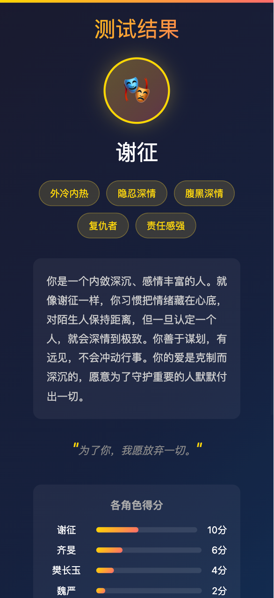
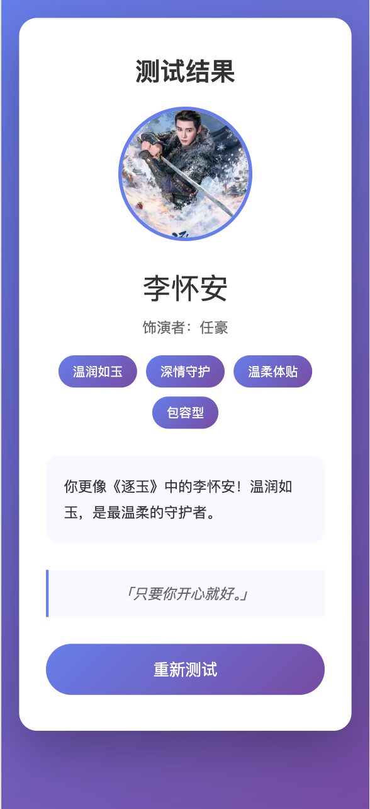

# 角色人格测试生成器

根据剧集创建 16 型人格风格的角色测试问卷。

## 项目简介

这是一个自动生成角色人格测试的工具，灵感来自 16 型人格测试。用户可以选择自己喜欢的剧集，通过回答测试题来匹配最像自己的角色。

## 功能特性

- 支持多剧集角色测试（鬼灭之刃、逐玉、白日提灯等）
- 20-25 道选择题，每题 4 个选项
- 包含角色分析、性格特质、经典台词
- 生成可直接使用的 H5 问卷页面

## 项目结构

```
x_test/
├── 鬼灭之刃/           # 鬼灭之刃角色测试
│   ├── data/
│   │   └── questions.json
│   └── quiz.html
├── 逐玉/               # 逐玉角色测试
│   ├── data/
│   │   └── questions.json
│   └── quiz.html
├── demo/               # 示例图片
│   ├── img1.png
│   └── img2.png
└── .trae/skills/       # 测试生成技能
    └── character-personality-test/
```

## 示例效果





## 使用方式

1. 选择一个剧集项目（如 鬼灭之刃）
2. 打开对应的 `quiz.html` 文件
3. 开始测试并查看结果

## 技术栈

- HTML5 + CSS3 + JavaScript
- 3D 球面动画效果（斐波那契分布）
- 移动端响应式设计

##  License

MIT
